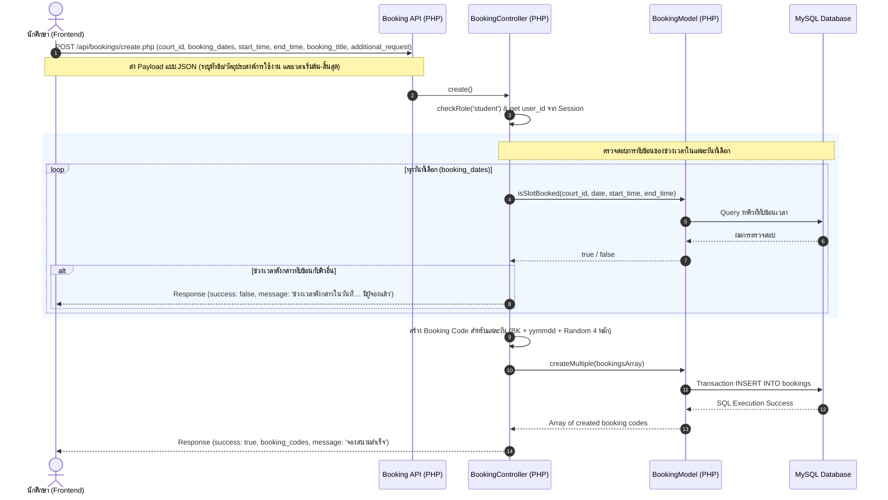

# Feature: Court Booking

## 1. Overview & Objective
- **สรุปภาพรวม:** ฟีเจอร์การจองสนามกีฬา (Court Booking) เป็นระบบหลักของ PSRU Sports Booking ที่ทำหน้าที่อำนวยความสะดวกให้นักศึกษาในมหาวิทยาลัยราชภัฏพิบูลสงครามสามารถค้นหาสนามกีฬา ตรวจสอบสถานะการใช้งานของสนามในวันนั้น ๆ และทำรายการจองสิทธิ์เข้าใช้งานล่วงหน้าผ่านทางระบบออนไลน์ได้โดยไม่มีค่าใช้จ่าย ซึ่งช่วยแก้ปัญหาการเดินมาต่อคิวที่หน้างาน ความซ้ำซ้อนในการจองเวลา และความไม่สะดวกในการติดต่อเจ้าหน้าที่
- **กลุ่มผู้ใช้งาน (Target Users/Roles):** 
  1. **Student (นักศึกษา):** ผู้ใช้งานหลักที่ต้องการค้นหาสนาม ตรวจสอบรอบเวลาว่าง และส่งคำขอจองสิทธิ์เล่นกีฬา
  2. **Staff (เจ้าหน้าที่ดูแลอาคาร/สนามกีฬา):** ผู้ดำเนินการตรวจสอบความเหมาะสมของคำขอ ตรวจเช็กผู้เข้าใช้งาน และกดอนุมัติ (Approve) หรือปฏิเสธ (Reject) คำขอจอง
  3. **Admin (ผู้ดูแลระบบ):** ผู้ตรวจสอบรายงานภาพรวม สถิติการใช้งาน และบริหารจัดการข้อมูลสนาม/ระบบจองทั้งหมด

---

## 2. Requirements & Business Logic
- **Functional Requirements:**
  1. ค้นหาและกรองสนามกีฬาตามชื่อสนาม ประเภทกีฬา วันที่เข้าใช้งาน และศูนย์การศึกษา (ศูนย์ทะเลแก้ว / ศูนย์ส่วนวังจันทน์)
  2. ดูรายละเอียดข้อมูลสนาม ภาพถ่ายสิ่งสถานที่จริง สิ่งอำนวยความสะดวก และกฎระเบียบของแต่ละสนาม
  3. ตรวจสอบช่วงเวลาที่ถูกจองแล้ว (Occupied/Booked Slots) ของสนามในแต่ละวันแบบ Real-time
  4. ทำการเลือกวันที่ต้องการเข้าเล่น (รองรับทั้งการจอง 1 วัน และการจองหลายวันต่อเนื่อง Date Range) พร้อมระบุเวลาเริ่มต้นและเวลาสิ้นสุดตามต้องการ (เช่น 16:30 - 19:00 น.) และกรอกคำขอเพิ่มเติมหรือยืมอุปกรณ์กีฬา
  5. ตรวจสอบประวัติการจองและสถานะของตนเอง (`pending`, `approved`, `rejected`, `completed`, `cancelled`)
  6. นักศึกษาสามารถยกเลิกใบจองของตนเองได้ เฉพาะเมื่อสถานะยังเป็น "รออนุมัติ (`pending`)" เท่านั้น
  7. เจ้าหน้าที่สามารถอนุมัติหรือปฏิเสธคำขอจองพร้อมระบุเหตุผลได้ผ่านทาง Dashboard

- **Business Rules:**
  1. **Flexible Booking (No Quota Limit):** ยกเลิกการจำกัดโควตาการจองต่อวัน นักศึกษาสามารถจองสนามได้หลายช่วงเวลาหรือหลายวันตามความต้องการ
  2. **Double Booking Prevention (Overlap Check):** ในช่วงเวลาเดียวกันของสนามเดียวกัน จะมีผู้จองที่ได้รับการอนุมัติหรือรออนุมัติได้เพียงแค่ **1 รายการ** เท่านั้น โดยระบบจะตรวจสอบการทับซ้อนของเวลาด้วยเงื่อนไข `(start_time < new_end AND end_time > new_start)`
  3. **Operating Hours:** ระบุเวลาเริ่มต้นและสิ้นสุดได้ตามความต้องการ โดยต้องอยู่ภายใต้เวลาเปิดและปิดให้บริการของสนามนั้น ๆ และเวลาเริ่มต้นต้องน้อยกว่าเวลาสิ้นสุด
  4. **Status Lifecycle:** 
     - เมื่อจองเริ่มต้น: สถานะจะเป็น `pending` (รออนุมัติ)
     - เจ้าหน้าที่อนุมัติ: สถานะเปลี่ยนเป็น `approved` (อนุมัติแล้ว)
     - เจ้าหน้าที่ปฏิเสธ: สถานะเปลี่ยนเป็น `rejected` (ปฏิเสธการจองพร้อมระบุเหตุผล)
     - นักศึกษายกเลิกเอง: สถานะเปลี่ยนเป็น `cancelled` (ยกเลิกแล้ว)
     - เมื่อสิ้นสุดการใช้งานจริง: เจ้าหน้าที่จะทำการ Check-in สถานะจะเปลี่ยนเป็น `completed` (เสร็จสิ้น)
  5. **Account Status Rule:** ผู้ใช้ที่มีสถานะโดนระงับใช้งาน (`status = 'suspended'`) จะไม่สามารถเข้าสู่ระบบหรือทำรายการจองได้
  6. **Student Email Domain Rule:** การสมัครสมาชิกของนักศึกษา จะต้องใช้อีเมลภายใต้โดเมนของมหาวิทยาลัยเท่านั้น (`@psru.ac.th` หรือ `@live.psru.ac.th`)
  7. **Password Security Rule:** รหัสผ่านสำหรับลงทะเบียน ต้องมีความยาวอย่างน้อย 8 ตัวอักษรขึ้นไป และต้องประกอบด้วยตัวอักษรภาษาอังกฤษ (A-Z หรือ a-z) อย่างน้อย 1 ตัว

- **Edge Cases & Error Handling:**
  1. **Race Condition (จองพร้อมกัน):** หากผู้ใช้สองคนทำรายการส่งฟอร์มจองรอบเวลาทับซ้อนกันเข้ามาพร้อม ๆ กัน ระบบฝั่ง Backend จะมีขั้นตอนการตรวจสอบ Double Check ใน Database Transaction หรือ `isSlotBooked()` อีกรอบก่อนเขียนตารางลงฐานข้อมูล เพื่อป้องกันการจองทับซ้อน
  2. **Invalid Session:** หาก Session หลุดระหว่างใช้งาน หรือพยายามส่ง Request โดยไม่ได้ผ่านการยืนยันตัวตน ระบบจะตอบกลับด้วยรหัสสถานะ HTTP `401 Unauthorized` และผลักดันผู้ใช้กลับไปยังหน้าล็อกอิน
  3. **Role Mismatch:** หากนักศึกษาพยายามเข้าถึงฟังก์ชันของเจ้าหน้าที่ หรือเจ้าหน้าที่พยายามจองสนามในฐานะนักศึกษา ระบบจะตอบกลับด้วยรหัส HTTP `403 Forbidden`

---

## 3. Technical Architecture & Data Flow

### Data Flow / Sequence Diagram


### Component / Module Breakdown
ระบบใช้สถาปัตยกรรมแบบ MVC (Model-View-Controller) ย่อยที่มีการส่งข้อมูลระหว่าง Frontend (HTML/JS) และ Backend (PHP) แบบ API Decoupled Architecture:

1. **Frontend / Presentation Layer:**
   - [booking-detail.html](file:///c:/xampp/htdocs/project-pai/booking-detail.html): หน้าจอแสดงข้อมูลจำเพาะของสนาม และฟอร์มการเลือกวันที่ (วันเดียว/หลายวัน) และระบุเวลาเริ่มต้น-สิ้นสุด
   - [assets/js/pages/booking-detail.js](file:///c:/xampp/htdocs/project-pai/assets/js/pages/booking-detail.js): สคริปต์ควบคุมการโหลดรายละเอียดสนาม, ดึงรอบเวลาที่ถูกจองแล้วผ่าน API, จัดการ UI Single/Range Date และ Time Selection และส่งข้อมูลจอง
   - [assets/js/layout.js](file:///c:/xampp/htdocs/project-pai/assets/js/layout.js): สคริปต์ส่วนกลางในการเช็กสิทธิ์ล็อกอิน (`checkAuth('student')`) และโหลดส่วนหัว/ท้ายของหน้าเว็บ

2. **Backend API Entrypoints (Routing Layer):**
   - [api/bookings/create.php](file:///c:/xampp/htdocs/project-pai/api/bookings/create.php): จุดเชื่อมโยง HTTP Request สำหรับการทำรายการสร้างข้อมูลการจอง
   - [api/bookings/cancel.php](file:///c:/xampp/htdocs/project-pai/api/bookings/cancel.php): จุดเชื่อมโยงสำหรับการยกเลิกการจอง
   - [api/bookings/user.php](file:///c:/xampp/htdocs/project-pai/api/bookings/user.php): จุดเชื่อมโยงสำหรับดึงประวัติการจองของผู้ใช้ที่กำลังล็อกอินอยู่
   - [api/courts/booked-slots.php](file:///c:/xampp/htdocs/project-pai/api/courts/booked-slots.php): ดึงรายการรอบเวลาที่ไม่ว่างของสนาม (รองรับวันที่เดียวหรือหลายวัน)

3. **Controller & Business Logic Layer:**
   - [BookingController.php](file:///c:/xampp/htdocs/project-pai/controllers/BookingController.php): คอนโทรลเลอร์ที่ประมวลผลคำขอ ทำการ Validation ตรวจสอบ Quota ป้องกัน Double Booking (Overlap Check) และสร้าง Booking Code
   - [BaseController.php](file:///c:/xampp/htdocs/project-pai/controllers/BaseController.php): คอนโทรลเลอร์ฐานที่ช่วยเรื่องการดึงค่า Input แบบ JSON/POST, ส่งผลลัพธ์กลับแบบ JSON และตรวจสอบบทบาทผู้ใช้งาน

4. **Model / Data Access Layer:**
   - [BookingModel.php](file:///c:/xampp/htdocs/project-pai/models/BookingModel.php): คลาสที่ทำหน้าที่ Execute คำสั่ง SQL ทั้งตรวจสอบคิวทับซ้อน, สร้างรายการจอง (เดี่ยว/กลุ่มผ่าน Transaction), ดึงประวัติการจองของนักศึกษาและฝั่งเจ้าหน้าที่
   - [BaseModel.php](file:///c:/xampp/htdocs/project-pai/models/BaseModel.php): คลาสฐานเก็บการเชื่อมต่อ Database ด้วย PDO (ดึง Instance จาก Config)

---

## 4. Data Models & Database Schema
โครงสร้างตารางข้อมูลที่เกี่ยวข้องกับการจองสนามจะอิงจากตารางหลัก `bookings` และตารางเชื่อมโยงในไฟล์ [database.sql](file:///c:/xampp/htdocs/project-pai/database.sql):

### 1. ตาราง `bookings` (เก็บรายการข้อมูลการจองสนามกีฬา)
| Field | Data Type | Constraints | Description |
| :--- | :--- | :--- | :--- |
| **id** (PK) | INT | AUTO_INCREMENT, PRIMARY KEY | รหัสหลักของรายการจอง |
| **booking_code** | VARCHAR(20) | UNIQUE, NOT NULL | รหัสคิวการจอง (เช่น BK2608275912) |
| **user_id** (FK) | INT | NOT NULL, REFERENCES `users(id)` | รหัสนักศึกษาผู้จอง |
| **court_id** (FK) | INT | NOT NULL, REFERENCES `courts(id)` | รหัสสนามที่ต้องการจอง |
| **booking_date** | DATE | NOT NULL | วันที่เข้าใช้งานสนาม |
| **start_time** | TIME | NOT NULL | เวลาเริ่มต้นของการเข้าเล่น |
| **end_time** | TIME | NOT NULL | เวลาสิ้นสุดของการเข้าเล่น |
| **booking_title** | VARCHAR(255) | NOT NULL | หัวข้อหรือวัตถุประสงค์การจองสนาม (จำเป็นต้องระบุ) |
| **additional_request**| TEXT | NULL | รายละเอียดขออุปกรณ์เพิ่มเติม/คำขออื่น ๆ |
| **status** | ENUM | NOT NULL, DEFAULT `'pending'` | สถานะการจอง: `'pending'`, `'approved'`, `'rejected'`, `'completed'`, `'cancelled'` |
| **approved_by** (FK) | INT | NULL, REFERENCES `users(id)` | รหัสเจ้าหน้าที่ผู้ดำเนินการตรวจสอบ |
| **rejection_reason** | TEXT | NULL | เหตุผลในกรณีที่ปฏิเสธการจอง |
| **created_at** | TIMESTAMP | DEFAULT `CURRENT_TIMESTAMP` | วันเวลาที่ทำรายการส่งข้อมูลเข้าระบบ |

### 2. Indexes & Constraints
- **Foreign Keys:**
  - `fk_bookings_users`: เชื่อม `user_id` กับตาราง `users(id)` โดยทำ `ON DELETE CASCADE`
  - `fk_bookings_courts`: เชื่อม `court_id` กับตาราง `courts(id)` โดยทำ `ON DELETE CASCADE`
  - `fk_bookings_staff`: เชื่อม `approved_by` กับตาราง `users(id)` โดยทำ `ON DELETE SET NULL`
- **Database Indexes:**
  - `idx_bookings_date_time`: ดัชนีแบบผสม `(court_id, booking_date, start_time)` บนตาราง `bookings` เพื่อเพิ่มประสิทธิภาพในการ Query ตรวจสอบหาช่วงเวลาว่างและป้องกันการจองซ้ำซ้อนได้อย่างรวดเร็ว

---

## 5. API / Interface Contracts

### 1. ดึงข้อมูลรอบเวลาการจองที่ไม่ว่าง
* **Endpoint:** `GET /api/courts/booked-slots.php`
* **Query Parameters:**
  - `court_id`: `1` (รหัสสนามกีฬา)
  - `date`: `2026-08-27` (วันที่ต้องการเช็ก กรณี 1 วัน)
  - `dates`: `2026-08-27,2026-08-28` (กรณีเช็กหลายวัน)
* **Headers / Auth:** จำเป็นต้องผ่านการล็อกอิน (Session cookie)
* **Response:**
  * **Success (200 OK):**
    ```json
    {
      "success": true,
      "booked_slots": [
        {
          "start_time": "17:00:00",
          "end_time": "18:30:00"
        }
      ]
    }
    ```

### 2. สร้างรายการจองสนามใหม่ (รองรับหลายวัน กำหนดเวลา และระบุวัตถุประสงค์)
* **Endpoint:** `POST /api/bookings/create.php`
* **Headers / Auth:** สิทธิ์ระดับนักศึกษา (`role = 'student'`) เท่านั้น
* **Request Body (JSON):**
  ```json
  {
    "court_id": 1,
    "booking_dates": ["2026-08-27", "2026-08-28"],
    "start_time": "16:30",
    "end_time": "18:30",
    "booking_title": "ซ้อมกีฬาฟุตซอลเพื่อสุขภาพ",
    "additional_request": "ขอยืมลูกฟุตซอลจำนวน 1 ลูกครับ"
  }
  ```
* **Response:**
  * **Success (200 OK):**
    ```json
    {
      "success": true,
      "message": "จองสนามสำเร็จทั้งหมด 2 วัน! กรุณารอเจ้าหน้าที่ตรวจสอบอนุมัติ",
      "booking_code": "BK2608274381",
      "booking_codes": ["BK2608274381", "BK2608289211"],
      "total_days": 2
    }
    ```
  * **Error - โควตาเต็มหรือห้องไม่ว่าง (200 OK หรือ 400 Bad Request):**
    ```json
    {
      "success": false,
      "message": "ขออภัย จำกัดสิทธิ์การจองสนามกีฬา 1 ครั้ง / วัน / คนเท่านั้นครับ"
    }
    ```
  * **Error - ไม่ได้ยืนยันตัวตน (401 Unauthorized):**
    ```json
    {
      "success": false,
      "message": "Unauthorized"
    }
    ```

### 3. ดึงประวัติการจองของตนเอง
* **Endpoint:** `GET /api/bookings/user.php`
* **Headers / Auth:** สิทธิ์เข้าใช้งานของตนเอง (ใช้ `user_id` จาก Session)
* **Response:**
  * **Success (200 OK):**
    ```json
    {
      "success": true,
      "bookings": [
        {
          "id": 15,
          "booking_code": "BK2608274381",
          "user_id": 1,
          "court_id": 1,
          "booking_date": "2026-08-27",
          "start_time": "17:00:00",
          "end_time": "18:00:00",
          "additional_request": "ขอยืมลูกฟุตซอลจำนวน 1 ลูกครับ",
          "status": "pending",
          "approved_by": null,
          "rejection_reason": null,
          "created_at": "2026-08-27 22:55:00",
          "court_name": "สนามฟุตซอล อาคารเอนกประสงค์",
          "sport_type": "futsal",
          "campus_name": "ศูนย์ทะเลแก้ว"
        }
      ]
    }
    ```

---

## 6. Implementation & Checklist

### รายการพัฒนาและตรวจสอบ (Checklist)
- [x] ตรวจสอบสกีมาฐานข้อมูล ตรวจเช็ก Index `idx_bookings_date_time` เพื่อรองรับความเร็วการค้นหา
- [x] พัฒนา `BookingModel` สำหรับเรียกข้อมูลการชนกันของเวลาและโควตาของสมาชิกรายวัน
- [x] ออกแบบโครงสร้างและพัฒนา `BookingController::create()` เพื่อจัดทำคิวกระบวนการและสุ่มรหัส `booking_code`
- [x] ตรวจสอบ Authentication Session และบทบาทผู้ใช้งานในแต่ละ Endpoint ทาง Backend
- [x] จัดการส่วนหน้ากาก UI `booking-detail.html` และควบคุมการสลับแสดงคิวที่ว่างผ่าน JavaScript
- [x] ทำการสร้าง Module ตรวจสอบสิทธิ์ผู้ใช้และสกัดกั้นผู้ใช้ที่ไม่พร้อมใช้ เช่น ผู้ใช้ที่โดน Blacklist หรือ Suspended

### ข้อควรระวังด้านความปลอดภัย (Security) และประสิทธิภาพ (Performance)
- **Security:**
  - **SQL Injection Prevention:** การเขียนคำสั่ง SQL ใน `BookingModel.php` ต้องใช้ **Prepared Statements (PDO Parameter Binding)** เสมอ หลีกเลี่ยงการสอดแทรกตัวแปรตรงลงใน SQL
  - **Input Sanitization:** ทำการตัดช่องว่างและตรวจสอบความถูกต้องของ Input เช่น `court_id` ต้องแปลงเป็น Integer เสมอ และตรวจสอบรูปแบบวันที่ด้วย Regex หรือฟังก์ชัน PHP
  - **Access Control:** ป้องกันไม่ให้ฝั่งนักศึกษายกเลิกการจองคนอื่น โดยในคำสั่ง SQL ยกเลิก ต้องมีเงื่อนไข `WHERE user_id = ?` ของผู้ล็อกอินเสมอ
- **Performance:**
  - **Indexed Lookup:** ใช้ดัชนีคีย์หลักและ Index `idx_bookings_date_time` เพื่อหลีกเลี่ยงการทำ Full-table scan เวลาทำการนับจำนวนโควตาและการชนของสล็อตเวลา
  - **Connection Pooling & Cleanup:** ตรวจสอบให้มั่นใจว่า PDO Connection ได้รับการเปิดใช้อย่างเหมาะสมและเชื่อมต่ออย่างถูกต้องผ่าน Base Model

### Test Cases ที่ควรได้รับการทดสอบ (Test Matrix)
1. **สิทธิ์การจองปกติ:** ลงทะเบียนนักศึกษา เข้าสู่ระบบ และดำเนินการจองสนามที่ว่างอยู่ 1 ครั้ง ผลลัพธ์ต้องจองสำเร็จ
2. **ขีดจำกัดจำนวนต่อวัน (Quota Exceed):** ดำเนินการจองสนามเดียวกันหรือคนละสนามในวันที่เดียวกันเป็นครั้งที่สอง ผลลัพธ์ต้องแจ้งเตือนปฏิเสธเนื่องจากใช้โควตาเต็มแล้ว
3. **จองชนเวลาที่ถูกครอบครอง (Double Booking Case):** จำลองสถานการณ์ผู้ใช้อีกราย พยายามกดจองสนามเดียวกัน วันที่เดียวกัน และรอบเวลาเดียวกัน ผลลัพธ์ต้องแจ้งเตือนว่าสนามถูกจองแล้ว
4. **การยกเลิกสถานะ (Cancellation Check):** 
   - นักศึกษาพยายามยกเลิกขณะสถานะเป็น `pending` -> ทำสำเร็จเปลี่ยนเป็น `cancelled`
   - นักศึกษาพยายามยกเลิกขณะสถานะเปลี่ยนเป็น `approved` หรือ `rejected` ไปแล้ว -> ทำไม่สำเร็จ
5. **การบล็อกไอดี (Suspended User Test):** เปลี่ยนสถานะนักศึกษาคนนั้นเป็น `suspended` ในฐานข้อมูลแล้วพยายามเข้าสู่ระบบเพื่อใช้งานจอง -> ต้องไม่สำเร็จและแสดงแจ้งเตือนบล็อกบัญชี
